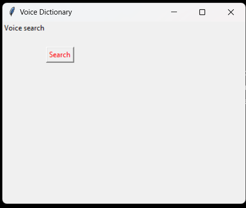

<br/>
<p align="center">
  <a href="https://github.com/SRB1025X/VocabVoice">
    
  </a>

  <h3 align="center">VocabVoice</h3>

  <p align="center">
    A Voice based Dictionary with a simple Interface
    <br/>
    <br/>
    <a href="https://github.com/SRB1025X/VocabVoice"><strong>Explore the docs »</strong></a>
    <br/>
    <br/>
  </p>
</p>


## Table Of Contents

* [About the Project](#about-the-project)
* [Built With](#built-with)
* [Getting Started](#getting-started)
  * [Prerequisites](#prerequisites)
  * [Installation](#installation)
* [Usage](#usage)
* [Authors](#authors)

## About The Project



The Voice Dictionary allows users to search for the meanings of words using voice commands. The application captures voice input through a microphone, recognizes the spoken words using Google's speech recognition, and then fetches the meanings of the recognized word using the PyDictionary library. The application provides a user-friendly interface built with Tkinter, displaying the voice search option, a label indicating the current status (listening or recognizing), and a label that shows the meaning of the searched word. The user triggers the search by clicking the "Search" button.

## Built With

* [Python3](https://www.python.org/)
* [Tkinter](https://docs.python.org/3/library/tkinter.html)
* [Pyttsx3](https://pypi.org/project/pyttsx3/)
* [SpeechRecognition](https://pypi.org/project/SpeechRecognition/)
* [PyDictionary](https://pypi.org/project/PyDictionary/)

## Getting Started

Here's a guide to help users get started with your Voice Dictionary application:

### Getting Started with Voice Dictionary

#### Prerequisites:

1. **Python:** Make sure you have Python installed on your system. You can download Python from [https://www.python.org/downloads/](https://www.python.org/downloads/).

#### Installation Steps:

1. **Clone the Repository:**
   Open your terminal or command prompt and run the following command to clone the Voice Dictionary repository to your local machine:

   ```bash
   git clone https://github.com/SRB1025X/VocabVoice.git
   ```

2. **Navigate to the Project Directory:**
   Change your current directory to the project folder:

   ```bash
   cd VocabVoice
   ```

3. **Install Required Python Packages:**
   Run the following command to install the necessary Python packages:

   ```bash
   pip install pyttsx3 SpeechRecognition PyDictionary
   ```

   This will install the required libraries for text-to-speech, speech recognition, and dictionary functionalities.

#### Running the Application:

1. **Run the Python Script:**
   Execute the following command to run the Voice Dictionary application:

   ```bash
   python VocabVoice.py
   ```

2. **Explore the Interface:**
   The application window will appear, featuring a "Voice search" label, a status label indicating the current state (listening or recognizing), and an area to display the meaning of the searched word. Click the "Search" button to initiate a voice search.

3. **Follow the Prompts:**
   The application will prompt you to speak the word you want to find the meaning of. Speak clearly into your microphone, and the application will recognize your voice and display the meaning.

4. **Enjoy Exploring Word Meanings:**
   Explore the application by searching for different words and listening to the spoken meanings.

#### Additional Notes:

- Ensure that your system has a working microphone for voice input.
- Adjust your system's audio settings to hear the spoken word meanings.
- If there are issues with speech recognition, check your internet connection as Google's speech recognition engine is used.

Congratulations! You have successfully set up and run the Voice Dictionary application on your machine. Feel free to contribute, provide feedback, or enhance the application based on your preferences!

### Usage

The Voice Dictionary application allows you to search for the meanings of words using voice commands. Follow these steps to effectively use the application:

1. **Launch the Application:**
   Run the application by executing the following command in your terminal or command prompt:

   ```bash
   python voice_dictionary.py
   ```

   The application window will appear, featuring the necessary labels and controls.

2. **Voice Search:**
   - Click the "Search" button to initiate a voice search.
   - The application will prompt you with "Which word do you want to find the meaning, sir?".

3. **Speak the Word:**
   - Speak clearly into your microphone the word for which you want to find the meaning.
   - The application will display the status as "Listening..." while capturing your voice.

4. **Recognition and Display:**
   - After capturing your voice, the status will change to "Recognizing...".
   - The recognized word will be displayed, and the meaning of the word will be shown in the area below.

5. **Audio Feedback:**
   - The application provides audio feedback by speaking the meaning of the word using text-to-speech (TTS).
   - Adjust your system's audio settings to ensure you can hear the spoken word meanings.

6. **Explore and Repeat:**
   - Explore the application by searching for different words and listening to the spoken meanings.
   - Click the "Search" button again to initiate a new search.

7. **Close the Application:**
   - Close the application window when you are done by clicking the close button.


Enjoy using the Voice Dictionary to effortlessly discover the meanings of words through voice commands! Feel free to contribute to the project or share your feedback for further improvements.
## Authors

* **Shreyas** - *Computer Science Student at JNTUH* - [Shreyas Github](https://github.com/SRB1025X) - [Shreyas Linkedin](https://www.linkedin.com/in/srb1025x/)
